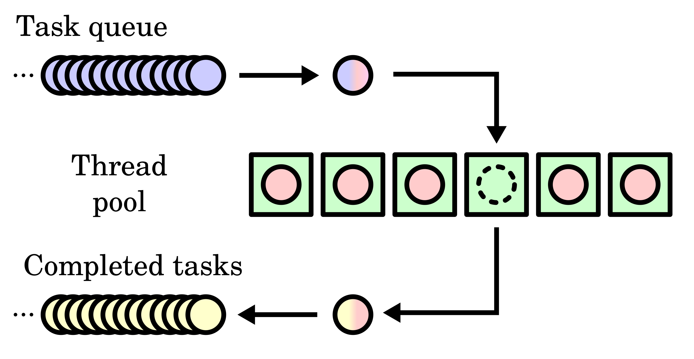

# 跨平台轻量级线程池(C++11)

[](https://github.com/abin-z/ThreadPool) [](include/thread_pool/thread_pool.h) [](https://learn.microsoft.com/en-us/cpp/cpp/welcome-back-to-cpp-modern-cpp?view=msvc-170) [](https://opensource.org/license/MIT) [](https://github.com/abin-z/ThreadPool/releases)

🌍 Languages/语言:  [English](README.md)  |  [简体中文](README.zh-CN.md)

**一个跨平台, 简单易用的Header-only线程池库, 基于Task提交, 支持提交任意参数提交, 支持获取返回值.**

------

## 📌 线程池简介

**线程池（Thread Pool）**是一种基于**池化思想**管理线程的工具，经常出现在多线程编程中。

它的核心思想是：**预先创建一定数量的线程放在“池子”里，任务来了就把任务交给空闲的线程来处理，而不是每次都新建线程。**



------

## 🚀特性亮点

- **任务提交灵活**：支持任意可调用对象与参数组合，返回 `std::future<T>` 获取执行结果
- **线程安全**：使用 `std::mutex` / `std::condition_variable` / `std::atomic` 构建同步机制
- **跨平台**：纯 C++11 实现，兼容 Windows 与 POSIX 等系统
- **Header-only**：仅需包含 `thread_pool.h`，零依赖，即可使用
- **RAII 自动管理资源**：析构时自动关闭线程池，防止资源泄露
- **任务等待机制**：支持主动调用 `wait_all()` 等待所有任务完成
- **灵活关闭策略**：默认是自动关闭线程池的, 如果有需要可以手动关闭线程池:
  - `WaitForAllTasks`: 等待所有任务完成后关闭
  - `DiscardPendingTasks`: 丢弃未开始的任务立即关闭

------

## 📦 快速开始

### 安装使用

拷贝[`thread_pool.h`](include/thread_pool/thread_pool.h)到你的项目目录，然后在代码中引入：

```cpp
#include "thread_pool.h"
```

无需额外依赖，完全头文件实现。

### 基础示例代码

**基础使用**

```cpp
#include "thread_pool.h"
#include <iostream>

int main() {
  abin::threadpool pool(4);

  auto future1 = pool.submit([] { return 42; });
  std::cout << "结果: " << future1.get() << "\n";

  auto future2 = pool.submit([](int a, int b) { return a + b; }, 5, 7);
  std::cout << "加法结果: " << future2.get() << "\n";

  return 0;
}
```

**提交任意类型任意参数的可调用对象**

<details>
<summary>点击展开查看代码</summary>

```cpp
#include "thread_pool.h"

#include <functional>
#include <future>
#include <iostream>
#include <string>

void normal_function(int x)
{
  std::cout << "normal_function: " << x << std::endl;
}

struct MyClass
{
  void member_function(int y)
  {
    std::cout << "MyClass::member_function: " << y << std::endl;
  }
  int add(int a, int b)
  {
    return a + b;
  }
};

struct Functor
{
  void operator()(const std::string& msg) const
  {
    std::cout << "Functor called with: " << msg << std::endl;
  }
};

int main()
{
  abin::threadpool pool(4);

  // 提交一个普通函数
  pool.submit(normal_function, 42);

  // 提交一个无捕获 lambda
  pool.submit([] { std::cout << "lambda no capture\n"; });

  // 提交一个有捕获 lambda
  int value = 99;
  pool.submit([value] { std::cout << "lambda with capture: " << value << "\n"; });

  // 提交成员函数, 使用lambda
  MyClass obj;
  pool.submit([&obj] { obj.member_function(123); });

  // 提交成员函数, 使用 std::mem_fn
  std::future<int> ret = pool.submit(std::mem_fn(&MyClass::add), &obj, 3, 4);
  std::cout << "add result1: " << ret.get() << "\n";

  // 提交成员函数, 使用 std::bind
  std::future<int> fut_add = pool.submit(std::bind(&MyClass::add, &obj, 2, 3));
  std::cout << "add result2: " << fut_add.get() << "\n";

  // 提交一个函数对象(仿函数)
  Functor f;
  pool.submit(f, "hello functor");

  // 使用 std::bind 提交
  auto bound = std::bind(&MyClass::add, &obj, 5, 6);
  std::future<int> fut_bound = pool.submit(bound);
  std::cout << "bound result: " << fut_bound.get() << "\n";

  // 提交一个 std::packaged_task(注意: 低版本msvc可能报错)
  std::packaged_task<std::string()> task([] { return std::string("from packaged_task"); });
  std::future<std::string> fut_str = task.get_future();
  pool.submit(std::move(task));  // 必须 move
  std::cout << "packaged_task result: " << fut_str.get() << "\n";

  pool.wait_all();  // 等待任务完成
  std::cout << "===All tasks completed.===\n";
}
```

</details>

更多更详细的使用案例, 请移步到[`examples`](examples/)文件夹下查看

------

## 📄  API 文档

### 构造与析构

```cpp
explicit threadpool(std::size_t thread_count = default_thread_count());
~threadpool();
```

- 构造时自动启动 `thread_count` 个工作线程
- 默认线程数使用 `std::thread::hardware_concurrency()`（若不可用则为 4）
- 析构时自动调用 `shutdown(WaitForAllTasks)`

### 提交任务

```cpp
template <typename F, typename... Args>
auto submit(F&& f, Args&&... args) -> std::future<decltype(f(args...))>;
```

- 将任务提交至线程池异步执行
- 支持任意函数和参数组合 (结合lambda可调用成员函数)
- 返回 `std::future` 对象以获取结果

### 等待任务完成

```cpp
void wait_all();
```

- 阻塞直到所有任务执行完毕（任务队列为空且无活跃线程）
- 若无任务，立即返回

### 关闭线程池

```cpp
void shutdown(shutdown_mode mode = shutdown_mode::WaitForAllTasks);
```

- 等待所有任务完成或立即丢弃未开始任务并退出
- 调用后线程池不可继续提交任务

### 重启线程池

```cpp
void reboot(std::size_t thread_count);
```

- 安全地关闭并以指定线程数重启线程池

### 获取状态信息

```cpp
bool is_running() const noexcept;                 // 线程池是否在运行
std::size_t total_threads() const noexcept;       // 线程池总共的线程数
std::size_t busy_threads() const noexcept;        // 繁忙的线程数量
std::size_t idle_threads() const noexcept;        // 空闲的线程数量
std::size_t pending_tasks() const noexcept;       // 正在等待的任务数量
threadpool::status_info status() const noexcept;  // 状态信息汇总
```

- 提供对池内部状态的详细了解

------

## ✅ 推荐使用线程池的场景

| 场景                                   | 原因                                 |
| -------------------------------------- | ------------------------------------ |
| 需要执行**大量独立的小任务**           | 避免频繁创建/销毁线程，提升效率      |
| 任务是短时间内可完成的                 | 利于线程复用，响应快速               |
| 任务是**非阻塞的**                     | 避免线程池线程被长期占用             |
| 希望控制并发量、节省资源               | 限制线程数防止系统过载               |
| 后台异步处理任务                       | 比如日志记录、延时执行、事件回调     |
| 需要统一管理线程生命周期               | 便于集中控制、重启、销毁等           |
| 使用 `future`/`promise` 等机制获取结果 | 线程池天然适合封装任务提交和结果返回 |

## ⚠️ 不推荐使用线程池的场景

| 场景                                   | 原因                                         |
| -------------------------------------- | -------------------------------------------- |
| 需要一个**前台线程**                   | 线程池线程默认是后台线程，进程无法依赖其存活 |
| 需要**设置线程优先级**                 | 线程池线程通常不可自定义优先级               |
| **任务会长时间阻塞**（如等待 I/O、锁） | 容易耗尽线程池资源，阻塞其他任务执行         |
| 需要将线程放入**单线程单元（STA）**    | 线程池线程默认属于多线程单元（MTA）          |
| 需要线程拥有**固定身份或长期状态**     | 线程池线程会被复用，难以绑定特定任务状态     |
| 需要线程**专用于某项任务**并长期运行   | 自定义线程更适合保持上下文和稳定性           |

## 💡 贡献指南

🗨️ 欢迎提交 **Issue** 和 **Pull request** 来改进本项目！

-----

## 🙌 致谢

感谢 **[Catch2](https://github.com/catchorg/Catch2)** 提供强大支持，助力本项目的单元测试!

感谢 **https://github.com/progschj/ThreadPool** 为本项目提供灵感!

------

## 📜 许可证

本项目采用[ **MIT** 许可证](./LICENSE)。

版权所有 © 2025–Present Abin。

------

## 🙋‍♂️ 作者

Abin 📎[GitHub](https://github.com/abin-z)
